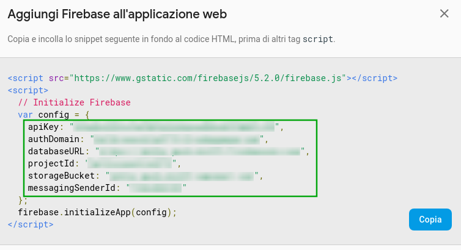
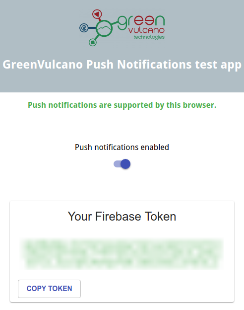
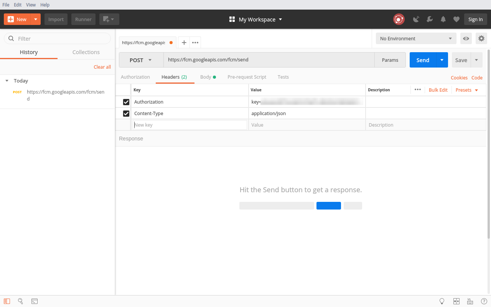
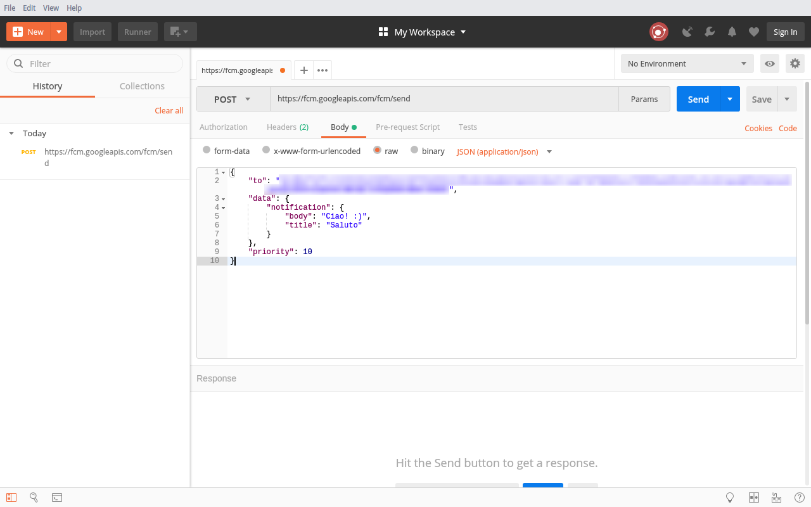
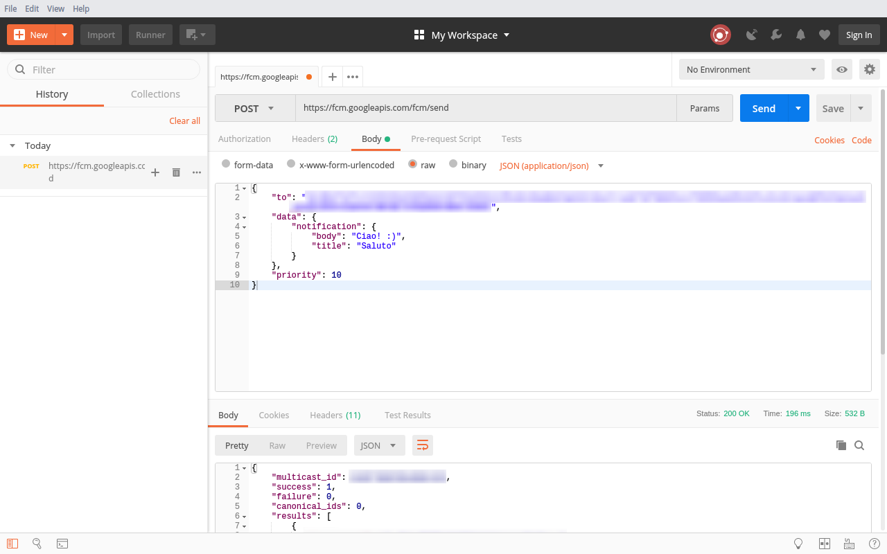
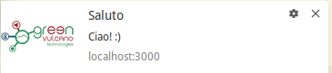

# GreenVulcano Push Notification test application

This is a React application used to test the subscription to a push notification server (Firebase in this case).

## Getting started

### Prerequisites

In order to build and run the Push Notifications client, you need to install the following frameworks:

- Node.js v9.8.0 or higher ([installation docs](https://nodejs.org/en/download/package-manager/));
- Yarn package manager v1.7.0 or higher ([installation docs](https://yarnpkg.com/lang/en/docs/install));
- A [Firebase](https://firebase.google.com/) API key to consume the [Firebase Cloud Messaging](https://firebase.google.com/products/cloud-messaging/) service.

In order to test the features of the application, you need the following applications:

- Web browser: only Google Chrome 63+ web browser is supported;
- HTTP client application (e.g. [Postman](https://www.getpostman.com/)).

Here we provide the installation steps needed to install the required frameworks on Ubuntu Linux 16.04.

```bash
sudo apt-get install git curl
curl -sL https://deb.nodesource.com/setup_10.x | sudo -E bash -
sudo apt-get install -y nodejs
sudo apt-get install -y build-essential

curl -sS https://dl.yarnpkg.com/debian/pubkey.gpg | sudo apt-key add -
echo "deb https://dl.yarnpkg.com/debian/ stable main" | sudo tee /etc/apt/sources.list.d/yarn.list
sudo apt-get update
sudo apt-get install yarn
```
### Cloning the repository

Once you installed the pre-required packages, you can proceed cloning the repository:

```
git clone https://github.com/mrambler90/gv-push-notifications-client
cd gv-push-notifications-client
```

The application receives push notifications from the Firebase platform. Before running the application, it's necessary to configure its code with a Firebase account.

### Configuring the Firebase Messaging client

This application is able to receive push notifications by the Firebase messaging service. The application contacts the Firebase
API to obtain a token string and displays it to the user.
This token can be used to send push notifications to the user by contacting the Firebase messaging service.

In order to test the application, you need to have a Firebase account, whose free tier currently (July 2018) allows issuing a fair amount of push notifications.

Firebase accounts are associated to a Google account. The Firebase registration procedure is very short: you can find further reference on [the Firebase website](https://firebase.google.com/).

Once you created your Firebase account, you need to create or use a Firebase application to serve the Push Notifications client.
If you need to create a Firebase application, open [your Firebase console](https://console.firebase.google.com), select "Add Project" and follow the instructions to create the application.
You don't need to opt-in any option in this wizard: you only need to accept the Firebase terms of service.

Then, in the Firebase console, open the Firebase application you just created. Select "Add Firebase to your Web app" in the center of the dashboard. The popup that will be shown displays the
code snippet that the Push Notifications application needs in order to to contact the Firebase API to subscribe to push notifications. The code that needs to be copied is highlighted in the following screenshot:



Replace the definition of the ```firebaseConfig``` variable with the highlighted code in the following files: ```src/App.js```,  ```public/firebase-messaging-sw.js```. This way, the Push Notifications application will be able to contact the Firebase API.

You're now ready to run the application.

## Running the application

First, open a terminal and reach the root folder of the cloned repository. Then, run:

```
yarn && yarn start
```

The application should be started, and a new browser tab containing the running application should be automatically opened.
Usually the application runs on ```localhost:3000``` (or on a different port, if port 3000 is held by another running process).
Check the output of the ```yarn start``` command to determine the correct internet address of the Push Notifications application.

### Generating a push notifications token

In the application window, push the switch button. The web browser will ask you for the permission to receive push notifications.
Once this permission is granted, the application will interact with the Firebase application you defined, and it will obtain a token
which will be displayed in the application window.



You will need this token to send push notifications to the application. You can copy it into your clipboard by pushing the **Copy Token** button.

### Sending a push notification to the application

The final step of this tutorial is sending a push notification to the Push Notifications application. In order to do so, you need to make an
HTTP request to the Firebase API, defined as follows.


```
POST https://fcm.googleapis.com/fcm/send

Headers:

Authorization: key=<your Firebase API key>
Content-Type: application/json

Body: {
    "to": "<the token you generated in the application>",
    "data": {
        "notification": {
            "body": "<the notification body>",
            "title": "<the notification title>"
        }
    },
    "priority": 10
}

```

Your Firebase API key is present in the apiKey parameter of the Firebase configuration code that you previouly inserted in the code.

You may use any HTTP client application to issue this HTTP request - such as [Postman](https://www.getpostman.com/). Once the HTTP request
is correctly sent, you should see that the push notification is received by the web browser.

Here's an example of the HTTP REST call execution with Postman:





After pushing the Send button in the Postman window, the following push notification will pop up:



## Note

This project was bootstrapped with [Create React App](https://github.com/facebookincubator/create-react-app).
